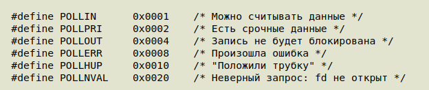

## Системные вызовы select, poll и epoll. Разница между ними. Реализация многопоточного сервера через epoll.

Вместо того чтобы опрашивать каждый fd в цикле, мы говорим ядру: «разбуди меня, 
когда хоть на одном из этих fd появятся данные». Поток спит — CPU свободен. 
Ядро отслеживает события внутри себя и будит поток только при реальной активности.

### `select`

Самый старый (POSIX), появился в BSD 4.2 (1983).

```cpp
int select(int nfds,
           fd_set *readfds,   // ждём готовности к чтению
           fd_set *writefds,  // ждём готовности к записи
           fd_set *exceptfds, // исключительные события
           struct timeval *timeout);
```

```cpp
fd_set read_fds;
FD_ZERO(&read_fds);
FD_SET(fd1, &read_fds);
FD_SET(fd2, &read_fds);

// Блокируемся до готовности хотя бы одного fd
int ready = select(max_fd + 1, &read_fds, nullptr, nullptr, nullptr);

// Проверяем какой именно готов
if (FD_ISSET(fd1, &read_fds)) { /* читаем fd1 */ }
if (FD_ISSET(fd2, &read_fds)) { /* читаем fd2 */ }
```

####  Для манипуляций наборами существуют четыре макроса:

* `FD_ZERO(fd_set *set)` - очищающий набор

* `FD_SET(int fd, fd_set *set)` и `FD_CLR(int fd, fd_set *set)` добавляют заданный описатель к набору или удаляют его из набора

* `FD_ISSET(int fd, fd_set *set)` проверяет, является ли описатель частью набора; этот макрос полезен после возврата из функции `select`

#### Ограничения select

* `fd_set` — битовая маска фиксированного размера 1024 бита (`FD_SETSIZE`). Нельзя слушать больше 1024 дескрипторов
* После каждого вызова select перезаписывает `fd_set` — нужно заново заполнять перед каждым вызовом
* Чтобы найти готовые fd — надо пробежать по всем битам маски: $\mathcal{O}(N)$ в userspace
* Каждый вызов копирует весь `fd_set` в ядро и обратно

### `poll`

Появился как замена `select` (POSIX.1-2001), снимает ограничение 1024.

```cpp
int poll(struct pollfd *fds, nfds_t nfds, int timeout);

struct pollfd {
    int   fd;       // дескриптор
    short events;   // что ждём (POLLIN, POLLOUT, ...)
    short revents;  // что случилось (заполняет ядро)
};
```

#### Возможные биты для `events` в `pollfd`



```cpp
std::vector<pollfd> fds = {
    {fd1, POLLIN, 0},
    {fd2, POLLIN | POLLOUT, 0},
};

int ready = poll(fds.data(), fds.size(), -1); // -1 = бесконечный timeout

for (auto& pfd : fds) {
    if (pfd.revents & POLLIN)  { /* читаем */ }
    if (pfd.revents & POLLOUT) { /* пишем  */ }
}
```

#### Улучшения над select
* Нет ограничения 1024 — массив pollfd любого размера
* Не перезаписывает входные данные (отдельные поля events и revents)

#### Проблемы poll
* Всё равно $\mathcal{O}(N)$: каждый вызов копирует весь массив в ядро, ядро проходит по всем fd
* При 10 000 fd и одном активном — 10 000 элементов копируются туда-обратно каждый раз
* Не масштабируется при большом числе соединений

### `epoll`

Linux-специфичный (Linux 2.5.44, 2002). Решает фундаментальную проблему: $\mathcal{O}(1)$ вместо $\mathcal{O}(N)$.

Ключевая идея: множество отслеживаемых fd хранится в ядре между вызовами. Не нужно каждый раз копировать список. Ядро само поддерживает список готовых fd и отдаёт только их.

### Разбор используемых команд

* `epoll_create` - создать дескриптор `epoll`
* `epoll_ctl` - интерфейс управления описателями `epoll`
* `epoll_wait` - ждать события ввода/вывода на описателе файла `epoll`

#### Примеры в коде

```cpp
// 1. Создать экземпляр epoll (возвращает fd)
int epfd = epoll_create1(0);

// 2. Добавить/изменить/удалить fd
int epoll_ctl(int epfd,
              int op,          // EPOLL_CTL_ADD / MOD / DEL
              int fd,
              struct epoll_event *event);

struct epoll_event {
    uint32_t events;  // EPOLLIN, EPOLLOUT, EPOLLET, ...
    epoll_data_t data; // пользовательские данные (ptr или fd)
};

// 3. Ждать событий
int epoll_wait(int epfd,
               struct epoll_event *events,  // массив готовых событий
               int maxevents,
               int timeout);
// Возвращает ТОЛЬКО готовые fd — не весь список!
```

```cpp
int epfd = epoll_create1(0);

// Добавляем fd в epoll
epoll_event ev;
ev.events = EPOLLIN;
ev.data.fd = client_fd;
epoll_ctl(epfd, EPOLL_CTL_ADD, client_fd, &ev);

// Ждём событий
epoll_event ready_events[64];
int n = epoll_wait(epfd, ready_events, 64, -1);

for (int i = 0; i < n; i++) {
    int fd = ready_events[i].data.fd;
    // Этот fd точно готов к чтению
    read(fd, buf, sizeof(buf));
}
```

#### LT vs ET режимы

```text
Level-Triggered (LT) — по умолчанию:
  epoll_wait уведомляет, пока данные не прочитаны до конца.
  Проще в реализации, похож на poll.

Edge-Triggered (ET) — флаг EPOLLET:
  Уведомление приходит ОДИН РАЗ при появлении новых данных.
  Нужно читать в цикле до EAGAIN — иначе событие потеряно.
  Эффективнее, но требует аккуратной реализации.
```

### Сравнение `select` / `poll` / `epoll`

|                       | `select`         | `poll`           | `epoll`                |
|-----------------------|------------------|------------------|------------------------|
| Лимит fd              | 1024             | Нет              | Нет                    |
| Копирование fd в ядро | Каждый вызов     | Каждый вызов     | Один раз (`epoll_ctl`) |
| Сложность на N fd     | $\mathcal{O}(N)$ | $\mathcal{O}(N)$ | $\mathcal{O}(1)$       |
| Результат             | Битовая маска    | Весь массив      | Только готовые         |
| Портируемость         | POSIX            | POSIX            | Linux only             |
| Поддержка ET          | Нет              | Нет              | Да                     |

### Внутреннее устройство `epoll` в ядре

```text
epoll instance:

  ┌─────────────────────────────────┐
  │  Red-Black Tree (rb-tree)       │  ← все зарегистрированные fd
  │  epoll_ctl: ADD/MOD/DEL → O(log N)  (вставка/удаление)
  └─────────────────────────────────┘

  ┌─────────────────────────────────┐
  │  Ready List (двусвязный список) │  ← только готовые fd
  │  epoll_wait → читает отсюда     │  O(готовых), не O(всех)
  └─────────────────────────────────┘
```