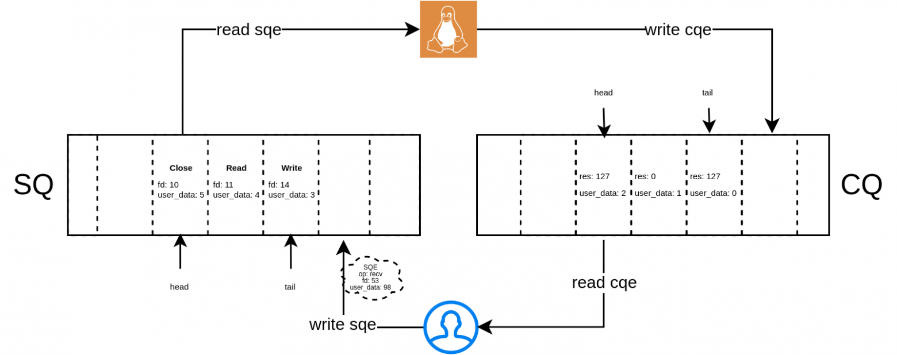

## Механизм io_uring. Реализация многопоточного сервера через io_uring. В чем преимущества и недостатки по сравнению с epoll?

Даже с `epoll` каждая операция требует syscall:

```text
epoll_wait()  ← syscall (ждём событий)
read()        ← syscall (читаем данные)
write()       ← syscall (пишем данные)
epoll_wait()  ← syscall (снова ждём)
```

При высокой нагрузке — тысячи syscall в секунду. Каждый syscall — переключение user→kernel→user (~100нс). io_uring устраняет эту проблему радикально.

### Идея `io_uring`: разделяемые кольцевые буферы

`io_uring` (Linux 5.1, 2019) создаёт два кольцевых буфера в памяти, 
которые видны одновременно userspace и ядру — без копирования, без syscall для каждой операции:

```text
Userspace                        Kernel
    │                               │
    │   ┌─────────────────────┐     │
    │   │  Submission Queue   │     │
    │   │       (SQ)          │     │
    │   │  [op1][op2][op3]... │     │
    │   │  ↑ пишет userspace  │     │
    │   │         читает ядро↓│     │
    │   └─────────────────────┘     │
    │                               │
    │   ┌─────────────────────┐     │
    │   │  Completion Queue   │     │
    │   │       (CQ)          │     │
    │   │  [res1][res2]...    │     │
    │   │  ↑ пишет ядро       │     │
    │   │    читает userspace↓│     │
    │   └─────────────────────┘     │
    │                               │
    └─── mmap (shared memory) ──────┘
```

### Lifecycle операции



Ключевое: одним syscall можно отправить 100 операций и получить 100 результатов — против 200 syscall в epoll+read/write модели.

### Сравнение `epoll` и `io_uring`

|                     | epoll                               | io_uring                                           |
|---------------------|-------------------------------------|----------------------------------------------------|
| Syscall на операцию | 2+ (epoll_wait + read/write)        | ~0 (batching, SQPOLL)                              |
| Копирование данных  | В каждом read/write                 | Нет (zero-copy с fixed buffers)                    |
| Модель              | Реактивная (уведомление → действие) | Проактивная (поставил задание → получил результат) |
| Поддержка           | Linux, зрелые версии                   | Linux ≥ 5.1 only                                   |
| API сложность       | Умеренная                           | Высокая                                            |
| Зрелость            | Очень зрелый (2002)                 | Молодой, активно развивается                       |
| Уязвимости          | Нет                                 | Были CVE (ядро < 5.15)                             |
| Производительность  | Высокая                             | Выше на 20–40% при высоком RPS                     |

#### Когда выбирать `epoll`, а когда `io_uring`

```text
Выбирай epoll если:              Выбирай io_uring если:

- нужна переносимость            - Linux-only, ядро ≥ 5.10
  (macOS, BSD, старый Linux)     - максимальная производительность
- простота поддержки кода        - нужен async файловый I/O
- небольшая/средняя нагрузка     - очень высокий RPS (> 100k/s)
- команда не знает io_uring      - батчинг операций критичен
```