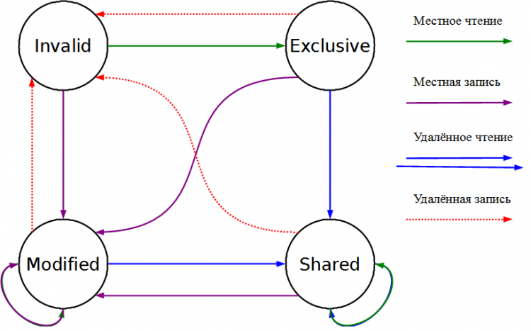

## Когерентность кэшей. Протокол MESI. Cache ping-pong. Проблема false sharing и ее решение.

### Проблема: у каждого ядра свой кэш

В многоядерных системах каждое ядро имеет собственный L1/L2 кэш. 
Если два ядра читают и пишут одну переменную — их кэши могут разойтись:

```text
Core 0 (кэш):  x = 5      Core 1 (кэш):  x = 7
                    ↕                          ↕
              RAM:  x = ?   ← какое значение правильное?
```

**Когерентность кэшей** — гарантия того, что все ядра видят **согласованное** значение одной ячейки памяти. 
Обеспечивается аппаратно протоколом MESI.

### Протокол MESI

Каждая **кэш-линия** (обычно 64 байта) в каждом ядре находится в одном из четырёх состояний:

```text
M — Modified   (изменена, только в этом кэше, RAM устарела)
E — Exclusive  (только в этом кэше, совпадает с RAM)
S — Shared     (в нескольких кэшах одновременно, совпадает с RAM)
I — Invalid    (данные устарели, нельзя использовать)
```



Пример: два ядра читают и пишут переменную x

```text
Начало: x = 0 в RAM

Core 0: read(x)
  → x загружается в кэш Core 0: состояние E (только я)

Core 1: read(x)
  → x загружается в кэш Core 1
  → Core 0: E → S, Core 1: S (оба читают)

Core 0: write(x = 5)
  → шина: «инвалидирую x у всех!»
  → Core 1: S → I  (кэш устарел)
  → Core 0: S → M  (только у меня, изменено)

Core 1: read(x)
  → кэш-линия I — промах!
  → Core 0 должен сбросить в RAM (M → S) или отдать напрямую
  → Core 1 получает x = 5: состояние S
```

Каждая инвалидация — сообщение по шине межпроцессорного взаимодействия (QPI/HyperTransport). Это занимает ~40-100нс.

### Cache Ping-Pong

**Cache ping-pong** — ситуация когда два ядра попеременно записывают одну кэш-линию, постоянно инвалидируя кэш друг друга:

```text
Core 0:  write(x) → инвалидирует Core 1
                          Core 1: read(x)  → промах, загружает
                          Core 1: write(x) → инвалидирует Core 0
Core 0:  read(x)  → промах, загружает
Core 0:  write(x) → инвалидирует Core 1
                          ...и так далее
```

```text
Временна́я шкала:
Core 0: W──────miss──W──────miss──W──────
Core 1: ──miss──W──────miss──W──────miss─
         ↑ промах  ↑ промах  ↑ промах
         каждый раз ~100нс задержки
```

Возникает при **конкурентном доступе** к одной переменной — например, spinlock или счётчик:

```cpp
std::atomic<int> counter{0};

// Поток 0:               // Поток 1:
while(true)               while(true)
  counter++;     ←──────►   counter++;
  // ping-pong на кэш-линии с counter
```

### False Sharing

**False sharing** — это cache ping-pong между данными, которые логически независимы, но физически попали в одну кэш-линию (64 байта):

```cpp
struct Data {
    int a;  // используется Core 0
    int b;  // используется Core 1
};
Data d;

// Core 0 пишет d.a → инвалидирует кэш-линию у Core 1
// Core 1 пишет d.b → инвалидирует кэш-линию у Core 0
// Хотя a и b НИКАК не связаны!
```

```text
Кэш-линия (64 байта):
┌────────────────────────────────────────────────────┐
│  d.a (4 байта)  │  d.b (4 байта)  │  padding...   │
└────────────────────────────────────────────────────┘
     ↑                    ↑
  Core 0 пишет         Core 1 пишет
  → вся линия инвалидируется у соседа!
```

```cpp
// 1. Массив счётчиков (каждый поток пишет в "свой" элемент):
int counters[NUM_THREADS];
// counters[0] и counters[1] в одной кэш-линии — false sharing!

// 2. Структура с полями разных потоков:
struct ServerStats {
    std::atomic<long> reads;   // поток-читалка
    std::atomic<long> writes;  // поток-писалка
    // оба в одной кэш-линии → ping-pong
};

// 3. Тред-пул: соседние Worker-объекты в векторе:
std::vector<Worker> workers(NUM_THREADS);
// workers[0] и workers[1] могут делить кэш-линию
```

### Решение false sharing: выравнивание

`alignas` + padding до размера кэш-линии

```cpp
constexpr size_t CACHE_LINE = 64;

// Каждый счётчик — в своей кэш-линии:
struct alignas(CACHE_LINE) PaddedCounter {
    std::atomic<long> value;
    // Компилятор добавит padding до 64 байт автоматически
};

PaddedCounter counters[NUM_THREADS];
// counters[0] начинается на offset 0
// counters[1] начинается на offset 64  ← разные кэш-линии!
```

`std::hardware_destructive_interference_size` (C++17)

```cpp
#include <new>

struct alignas(std::hardware_destructive_interference_size) Worker {
    std::atomic<int> task_count;
    // ... другие поля воркера
};
// hardware_destructive_interference_size = 64 на x86, 128 на ARM
```

Thread-local накопление + редкая синхронизация

```cpp
// ПЛОХО: каждый инкремент — потенциальный ping-pong
std::atomic<long> global_counter{0};
void worker() {
    for (int i = 0; i < 1000000; i++)
        global_counter++; // ping-pong!
}

// ХОРОШО: накапливаем локально, сбрасываем редко
thread_local long local_counter = 0;
std::atomic<long> global_counter{0};

void worker() {
    for (int i = 0; i < 1000000; i++)
        local_counter++;             // только в L1 этого ядра

    global_counter += local_counter; // один раз в конце
}
```