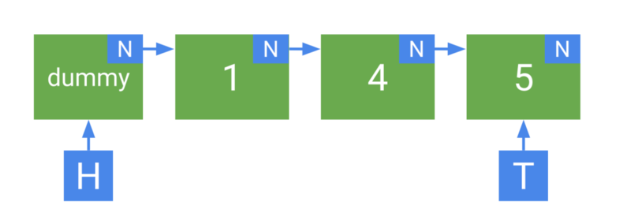

## Lock-free очередь (очередь Майкла-Скотта) и ее реализация. Проблема ABA, решение этой проблемы.

### Очередь Майкла-Скотта (Michael-Scott Queue, 1996)

Lock-free очередь на односвязном списке с двумя указателями: `head` (откуда читаем) и `tail` (куда пишем). 
Ключевая идея — голова и хвост обновляются независимо, что позволяет `enqueue` и `dequeue` работать параллельно без конфликтов.

#### Структура



**Sentinel (dummy) узел** — пустой узел всегда стоит перед первым элементом. 
Это упрощает логику: head всегда указывает на dummy, реальные данные начинаются с `head->next`.

### Реализация

```cpp
#include <atomic>
#include <optional>

template<typename T>
class MSQueue {
    struct Node {
        std::optional<T>   value;
        std::atomic<Node*> next{nullptr};

        Node() = default;
        explicit Node(T val) : value(std::move(val)) {}
    };

    alignas(64) std::atomic<Node*> head_;
    alignas(64) std::atomic<Node*> tail_;

public:
    MSQueue() {
        Node* dummy = new Node();
        head_.store(dummy);
        tail_.store(dummy);
    }

    // Enqueue: добавить в хвост
    void enqueue(T value) {
        Node* new_node = new Node(std::move(value));

        while (true) {
            Node* tail = tail_.load(std::memory_order_acquire);
            Node* next = tail->next.load(std::memory_order_acquire);

            if (tail != tail_.load(std::memory_order_acquire)) continue;

            if (next == nullptr) {
                if (tail->next.compare_exchange_weak(
                        next, new_node,
                        std::memory_order_release,
                        std::memory_order_relaxed)) {
                    tail_.compare_exchange_strong(
                        tail, new_node,
                        std::memory_order_release,
                        std::memory_order_relaxed);
                    return;
                }
            } else {
                tail_.compare_exchange_strong(
                    tail, next,
                    std::memory_order_release,
                    std::memory_order_relaxed);
            }
        }
    }

    // Dequeue: забрать из головы
    std::optional<T> dequeue() {
        while (true) {
            Node* head = head_.load(std::memory_order_acquire);
            Node* tail = tail_.load(std::memory_order_acquire);
            Node* next = head->next.load(std::memory_order_acquire);

            if (head != head_.load(std::memory_order_acquire)) continue;

            if (head == tail) {
                if (next == nullptr) {
                    return std::nullopt;
                }

                tail_.compare_exchange_strong(
                    tail, next,
                    std::memory_order_release,
                    std::memory_order_relaxed);
                continue;
            }

            T value = std::move(*next->value);

            if (head_.compare_exchange_weak(
                    head, next,
                    std::memory_order_release,
                    std::memory_order_relaxed)) {
                delete head;
                return value;
            }
        }
    }

    ~MSQueue() {
        while (dequeue().has_value()) {}
        delete head_.load();
    }
};
```

### Механизм "Helping"

Ключевая особенность алгоритма — помощь незавершённым операциям. 
Если поток приостановился после вставки узла, но до обновления `tail`.

Это делает алгоритм lock-free: даже если один поток завис, другие продвигают очередь вперёд.

### Проблема ABA

ABA возникает при `dequeue`. Поток читает `head`, его вытесняют, другой поток удаляет и переиспользует тот же адрес.

#### Для наглядности ABA стоит привести пример на стеке

Пусть стек такой:

```text
head -> A -> B -> C
```

Поток T1 хочет сделать `pop()`:

* читает `old_head = A`;

* читает `next = B`;

* собирается сделать `CAS(head, A, B)`.

Но его вытесняют.

Что делают другие потоки
Пока T1 спит, поток T2 делает:

* `pop(A)` → теперь `head -> B -> C`

* `pop(B)` → теперь `head -> C`

* `push(A)` → теперь снова `head -> A -> C`

**Обратим внимание:** `head` снова указывает на `A`, то есть внешне значение стало таким же, как видел T1 раньше, хотя стек уже изменился.

В итоге T1 ставит `head = B`, хотя корректный стек сейчас был `A -> C`, и структура ломается.

### Решение 1: Tagged Pointer (версионный счётчик)

Упаковать счётчик в указатель. На x86-64 верхние 16 бит виртуального адреса не используются:

```cpp
struct TaggedPtr {
    uintptr_t value;

    static TaggedPtr make(Node* ptr, uint16_t tag) {
        return { (uintptr_t(tag) << 48) | (uintptr_t(ptr) & 0x0000'FFFF'FFFF'FFFF) };
    }

    Node*    ptr() const { return reinterpret_cast<Node*>(value & 0x0000'FFFF'FFFF'FFFF); }
    uint16_t tag() const { return value >> 48; }

    bool operator==(TaggedPtr o) const { return value == o.value; }
};

std::atomic<TaggedPtr> head_;
std::atomic<TaggedPtr> tail_;

TaggedPtr new_head = TaggedPtr::make(next, old_head.tag() + 1);
head_.compare_exchange_weak(old_head, new_head, ...);
```

### Решение 2: Hazard Pointers

Каждый поток публикует адреса узлов которые он сейчас использует — они не могут быть удалены:

```cpp
constexpr int MAX_THREADS = 64;
std::atomic<Node*> hazard_ptrs[MAX_THREADS];
thread_local int   thread_id = /* назначается при старте */;

std::optional<T> dequeue() {
    while (true) {
        Node* head = head_.load(std::memory_order_acquire);

        hazard_ptrs[thread_id].store(head, std::memory_order_seq_cst);

        if (head != head_.load(std::memory_order_acquire)) continue;

        Node* next = head->next.load(std::memory_order_acquire);
        if (next == nullptr) {
            hazard_ptrs[thread_id].store(nullptr);
            return std::nullopt;
        }

        T value = *next->value;

        if (head_.compare_exchange_weak(head, next, ...)) {
            hazard_ptrs[thread_id].store(nullptr);
            retire(head);
            return value;
        }
    }
}

void retire(Node* node) {
    retired_list.push_back(node);

    if (retired_list.size() >= THRESHOLD) {
        for (Node* n : retired_list) {
            bool safe = true;
            for (int i = 0; i < MAX_THREADS; i++) {
                if (hazard_ptrs[i].load() == n) {
                    safe = false; break;
                }
            }
            if (safe) delete n;
        }
    }
}
```

### Сравнение решений ABA

| Решение           | Сложность | Производительность | Ограничения                                 |
| ----------------- | --------- | ------------------ | ------------------------------------------- |
| Tagged Pointer    | Низкая    | Высокая            | Зависит от архитектуры (16 бит тега)        |
| Hazard Pointers   | Средняя   | Средняя            | $\mathcal{O}(N·P)$ памяти, N потоков                    |